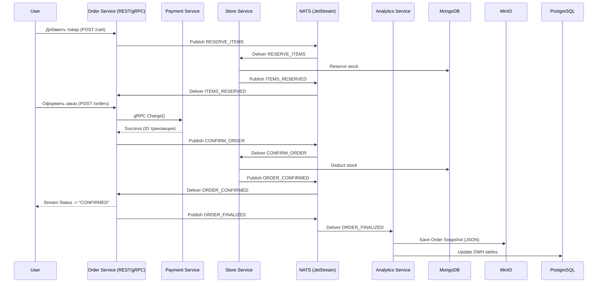

# Учебный проект: "Микросервисная платформа обработки заказов (E-commerce)"

---

## 1. Введение и цели проекта

Данный проект выполняется в рамках курса [«Микросервисы на Go»](https://otus.ru/lessons/microservices-go/). Цель — разработать комплексное связанное решение, демонстрирующее навыки проектирования распределенных систем, асинхронного взаимодействия, работы с базами данных и наблюдаемостью.

**Ключевые цели:**
1. Применить паттерн **Saga (Choreography)** для управления распределенной транзакцией заказа.
2. Реализовать гибридное взаимодействие: **синхронное** (gRPC) для критичных операций и **асинхронное** (NATS) для фоновых процессов.
3. Обеспечить полную наблюдаемость: логи (Loki), метрики (Prometheus) и распределенное хранение (MinIO).
4. Продемонстрировать работу с реляционными (PostgreSQL) и NoSQL (MongoDB) базами данных.

---

## 2. Архитектурные решения (ADR)

### ADR 1. Синхронный платеж против асинхронного
**Контекст:** При оформлении заказа необходимо списать средства.  
**Решение:** Использовать синхронный вызов gRPC из Order Service в Payment Service.  
**Обоснование:** Платеж — критически важная операция, требующая мгновенной обратной связи. Пользователь должен сразу видеть ошибку (недостаток средств, блокировка карты). Асинхронность ввела бы задержки и усложнила UX. Однако, последующая компенсация (возврат) может инициироваться асинхронно при сбоях склада.

### ADR 2. Резервирование товаров на этапе корзины (асинхронно)
**Контекст:** Товар может быть дефицитным.  
**Решение:** Добавление товара в корзину инициирует асинхронное событие `RESERVE_ITEMS` в Store Service через NATS.  
**Обоснование:** Это позволяет "заморозить" товар за пользователем до момента оплаты, снижая конфликты. При этом операция добавления в корзину не блокирует пользовательский интерфейс (асинхронность через брокер).

### ADR 3. gRPC Streaming для статусов, а не для данных
**Контекст:** Необходимо реализовать требование "gRPC Streaming".  
**Решение:** Order Service предоставляет метод `WatchOrderStatus`, который стримит клиенту текущий статус обработки заказа.  
**Обоснование:** Использовать стриминг для отправки больших объемов данных нецелесообразно. Отправка статусов (PENDING -> RESERVED -> PAID -> CONFIRMED) в реальном времени решает бизнес-задачу отслеживания и элегантно демонстрирует технику stream API.

### ADR 4. Выбор БД: PostgreSQL + MongoDB
**Контекст:** Разные сервисы имеют разные требования к данным.  
**Решение:**
- **PostgreSQL:** Order Service (транзакции, ACID), Payment Service (финансовые операции).
- **MongoDB:** Store Service (гибкая схема для хранения атрибутов товаров, размеров, цветов).
- **Redis:** Внешний кэш для Session/корзины в Order Service.
**Обоснование:** Полиглотное хранение позволяет использовать лучший инструмент под задачу.

### ADR 5. NATS как брокер сообщений
**Контекст:** Асинхронное взаимодействие между 5 сервисами.  
**Решение:** Использовать NATS с включенным JetStream.  
**Обоснование:** NATS легковесен, идеально ложится в экосистему Go, имеет встроенный механизм гарантированной доставки (JetStream) и проще в настройке, чем Kafka, для учебного проекта.

### ADR 6. MinIO + PostgreSQL для Аналитики
**Контекст:** Требуется распределенное хранилище.  
**Решение:** Analytics Service пишет сырые события в MinIO (как S3-совместимый бакет) в формате JSON (создание чеков/снепшотов заказов) и агрегированные данные в отдельную PostgreSQL-витрину.  
**Обоснование:** MinIO запускается локально в Docker, имитируя облачное S3, и автоматически инициализируется через `init-container`. Это закрывает требование по распределенному хранилищу без привязки к внешним облачным провайдерам.

### ADR 7. Loki вместо Elastic
**Контекст:** Сбор и хранение логов.  
**Решение:** Использовать Loki для аггрегации логов и Grafana для их просмотра.  
**Обоснование:** Loki потребляет значительно меньше ресурсов, чем Elasticsearch, и тесно интегрируется с Grafana, что упрощает настройку дашбордов для "звездочки".

### ADR 8. Общие пакеты в `pkg/`

**Контекст:** Несколько микросервисов используют одинаковую инфраструктуру (slog, health probes).  
**Решение:** Вынести технический код в отдельный Go-модуль [`pkg/`](../pkg/) (`logging`, `health`, позже — OTel/Prometheus helpers).  
**Связь с сервисами:** модуль `github.com/trb1maker/microservices/pkg`; в `go.mod` каждого сервиса — `require` + `replace => ../../pkg` (подмодуль не публикуется в proxy). В [`go.work`](../go.work) — `use` для `pkg` и всех сервисов; Docker копирует `go.work` при сборке.
**Обоснование:** Единообразие логов и проб без дублирования; домен и конфигурация остаются в `services/<name>/internal/`.  
**Не входит в pkg:** бизнес-сущности, use cases, миграции БД, env-структуры сервисов.

---

## 3. Описание бизнес-процесса (User Journey)

В системе выделены три основных сценария: успешный заказ, отказ склада и отмена заказа.

### 3.1. Сценарий A: Успешное оформление заказа

1. **Корзина:** Пользователь добавляет товар. Order Service отправляет событие `RESERVE_ITEMS` в NATS. Store Service резервирует товар (MongoDB), публикует `ITEMS_RESERVED`. Order обновляет статус корзины.
2. **Платеж:** Пользователь нажимает "Оплатить". Order Service вызывает Payment Service **синхронно** по gRPC (`Charge`). Деньги списаны.
3. **Склад:** Order Service публикует `CONFIRM_ORDER`. Store Service получает событие и переводит резерв в реальное списание. Публикует `ORDER_CONFIRMED`.
4. **Финализация:** Order Service меняет статус заказа на `CONFIRMED`. Публикует `ORDER_FINALIZED`.
5. **Но и Аналитика:** Notification Service шлет уведомление (лог). Analytics Service слушает событие, сохраняет чек в MinIO и витрину в PostgreSQL.

### 3.2. Сценарий B: Отказ склада (Компенсация)

1. Пункты 1-2 (Платеж) выполнены. Деньги списаны успешно.
2. Order шлет `CONFIRM_ORDER`.
3. Store Service не может выполнить списание (не хватает кол-ва). Он шлет событие `RESERVATION_FAILED`.
4. Order Service получает `RESERVATION_FAILED`. Запускает **компенсирующую транзакцию**:
    - Синхронно вызывает gRPC-метод `Refund` у Payment Service (возврат денег).
    - Меняет статус заказа на `CANCELLED`.
    - Публикует `ORDER_CANCELLED` (для уведомления пользователя об отмене).

### 3.3. Сценарий C: Отмена заказа пользователем

1. Пользователь вызывает REST DELETE `/orders/{id}`.
2. Order Service смотрит статус:
    - Если `PENDING`/`RESERVED`: шлет `RELEASE_RESERVATION` (снимаем блокировку), заказ удаляется.
    - Если `PAID`: шлет `CANCELLATION_REQUEST`. Воркер обработки возврата запускает цепочку `Release Reservation` -> `Refund Payment` (асинхронно через NATS).
    - Если `CONFIRMED`/`SHIPPED`: отмена запрещена (код ошибки 400).

---

## 4. Состав микросервисов

В проекте реализуется 5 микросервисов на Go.

| №    | Название             | Зона ответственности                                                                 | Входящий протокол                                                         | Исходящий протокол                             | База данных                                        |
| :--- | :------------------- | :----------------------------------------------------------------------------------- | :------------------------------------------------------------------------ | :--------------------------------------------- | :------------------------------------------------- |
| 1    | Order Service (BFF)  | Управление корзиной, заказами, жизненным циклом. Оркестрация Saga на основе событий. | **REST** (Фронт) **NATS** (Ответы склада) **gRPC** (Stream-клиенты) | gRPC (Платежи) **NATS** (Команды складу)    | **PostgreSQL** (заказы) **Redis** (кэш корзины) |
| 2    | Payment Service      | Обработка платежей и возвратов. Гарантирует консистентность денежных средств.        | **gRPC** (Унарный `Charge`/`Refund`)                                      | **NATS** (События платежей для аналитики)      | **PostgreSQL** (транзакции)                        |
| 3    | Store Service        | Резервирование, списание и управление складскими остатками.                          | **NATS** (Команды: резерв, подтверждение, освобождение)                   | **NATS** (Результаты операций)                 | **MongoDB** (гибкая схема товаров)                 |
| 4    | Notification Service | Отправка уведомлений (email/sms) пользователю.                                       | **NATS** (События финализации/отмены)                                     | **Loki** (логирование событий)                 | *Нет*                                              |
| 5    | Analytics Service    | Сбор данных в "озеро" (MinIO) и построение витрин для дашбордов.                     | **NATS** (Все финальные события)                                          | **MinIO** (S3 API) **PostgreSQL** (витрина) | **PostgreSQL** + **MinIO**                         |

---

## 5. Технические требования к реализации

### 5.1. Стек технологий
- **Язык:** Go 1.22+ (минимум 3 сервиса в исходниках).
- **Базы данных:** PostgreSQL, MongoDB, Redis.
- **Брокер:** NATS with JetStream.
- **Хранилище:** MinIO (эмуляция S3).
- **Наблюдаемость:** Prometheus (метрики), Loki (логи), Grafana (дашборды).
- **API:** REST (Swaggo для Swagger), gRPC (Protocol Buffers).
- **Контейнеризация:** Docker + Docker Compose.

### 5.2. Интеграционные тесты
Каждый сервис должен содержать интеграционные тесты, поднимающие `testcontainers` (PostgreSQL, MongoDB, NATS) для проверки бизнес-логики.

### 5.3. Логирование и Метрики
- Все сервисы пишут структурированные логи (JSON) в `stdout`, которые собираются Loki для просмотра в Grafana.
- Экспорт метрик в Prometheus (стандартные метрики HTTP/gRPC + кастомная метрика `orders_created_total`).

### 5.4. Запуск
- Обязательный `docker-compose.yml` для поднятия всех сервисов и инфраструктуры одной командой.
- Скрипт инициализации (MinIO bucket создается автоматически через `init-container`).

---

## 6. Диаграмма взаимодействия (Flow)

---

## 7. Заключение

Предложенная архитектура удовлетворяет всем требованиям курсового проекта:
- **Разделение ответственности:** Каждый сервис решает свою бизнес-задачу.
- **Гибридное взаимодействие:** Критичные данные (деньги) — синхронно, долгие задачи (склад) — асинхронно.
- **Технологический охват:** Покрыты все заявленные технологии (REST, Swagger, gRPC, Streaming, SQL, NoSQL, Broker, Loki, Prometheus, MinIO).
