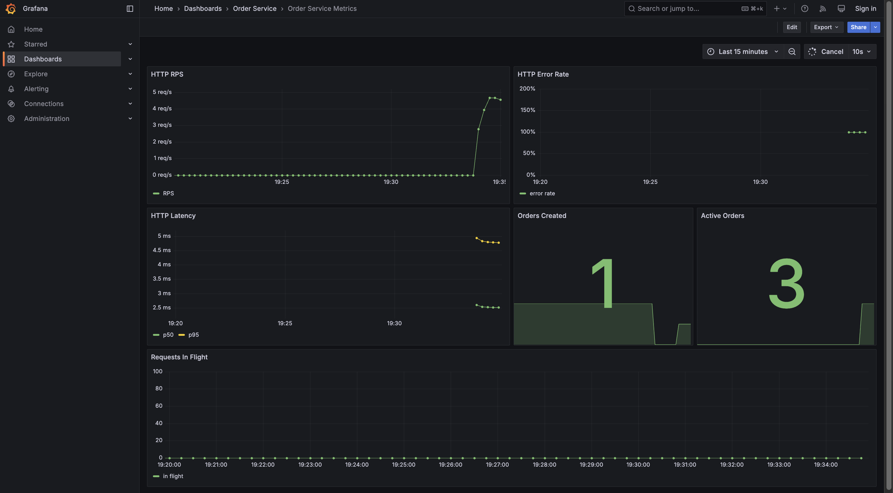
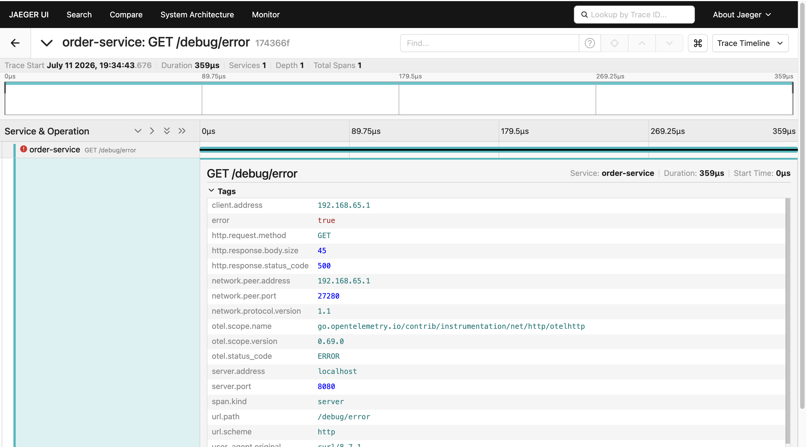

# Отчёт спринта 3: Наблюдаемость

**Период:** 06.07 – 12.07  
**Сервис:** `order-service`  
**Цель:** логи (Loki), метрики (Prometheus), трассировка (Jaeger), дашборды Grafana, алертинг.

---

## 1. Реализованный стек

| Компонент         | Порт                    | Назначение                               |
| ----------------- | ----------------------- | ---------------------------------------- |
| order-service     | 8080                    | REST API, `/metrics`, JSON-логи в stdout |
| Loki              | 3100                    | Хранение логов                           |
| Promtail          | —                       | Сбор stdout контейнеров через Docker SD  |
| Prometheus        | 9090                    | Scrape метрик, alert rules               |
| Alertmanager      | 9093                    | Маршрутизация алертов                    |
| webhook-receiver  | 5001                    | Приём webhook (логи в stdout)            |
| Jaeger            | 16686 (UI), 4318 (OTLP) | Распределённая трассировка               |
| Grafana           | 3000                    | Дашборды (admin/admin)                   |
| postgres-exporter | 9187                    | Метрики PostgreSQL                       |
| nats-exporter     | 7777                    | Метрики NATS                             |

### Запуск

```bash
cp .env.example .env   # при первом запуске
task obs:up            # полный стек
task obs:demo          # демо-трафик (заказы + 5xx для алертов)
task obs:down          # остановка
```

Для разработки без observability-стека: `task infra:up` + `task run SERVICE=order-service`.

---

## 2. Логирование (slog → Loki)

- JSON `slog` в stdout (`LOG_FORMAT=json`)
- Access log middleware: `method`, `path`, `route`, `status`, `duration_ms`, `trace_id`
- Бизнес-события: `checkout_started`, `checkout_completed`, `order_cancelled`, `nats_publish_failed`
- Promtail парсит JSON и добавляет labels `level`, `trace_id`, `service`

**Пример записи:**

```json
{
  "time": "2026-07-11T10:42:01Z",
  "level": "INFO",
  "msg": "checkout_completed",
  "order_id": "3e6759dd-bd2b-41d7-ad11-a8e9c11c574c",
  "user_id": "6855bf27-0d7d-4cf2-be12-6ce5b578e617",
  "trace_id": "a1b2c3d4e5f6789012345678abcdef01"
}
```

**Проверка в Loki:**

```bash
curl -G 'http://localhost:3100/loki/api/v1/query_range' \
  --data-urlencode 'query={service="order-service"} | json' \
  --data-urlencode 'limit=10'
```

**Grafana:** дашборд *Order Service Logs*.

### trace_id как label Loki (учебный компромисс)

`trace_id` индексируется и как **поле JSON** в теле лога, и как **label** Loki (`level`, `trace_id`, `service`). Это намеренное решение для учебного проекта:

- **Зачем:** быстрая корреляция логов и трейсов в Grafana без дополнительных инструментов — фильтр `{service="order-service", trace_id="..."}` сразу показывает все записи одного запроса.
- **Почему допустимо здесь:** локальный стек, малый объём трафика, демонстрация для ДЗ.
- **Почему не так в production:** `trace_id` уникален на каждый запрос → высокая кардинальность label → рост индекса Loki, замедление запросов. В prod рекомендуется оставлять `trace_id` только полем JSON и искать через `| json` или корреляцию в Tempo/Jaeger.

**Примеры LogQL:**

```logql
# Фильтр по label (удобно в учебном стеке)
{service="order-service", trace_id="a1b2c3d4e5f6789012345678abcdef01"}

# Фильтр по полю JSON (альтернатива, ближе к prod-практике)
{service="order-service"} | json | trace_id="a1b2c3d4e5f6789012345678abcdef01"
```

**Workflow:** скопировать `trace_id` из Jaeger UI (trace `POST /orders`) → вставить в переменную `trace_id` на дашборде *Order Service Logs* или в LogQL.

---

## 3. Метрики (Prometheus)

Экспорт на `GET /metrics` (namespace `order_service`):

| Метрика                         | Тип       | Описание                        |
| ------------------------------- | --------- | ------------------------------- |
| `http_requests_total`           | Counter   | Запросы по method/route/status  |
| `http_request_duration_seconds` | Histogram | Latency                         |
| `http_requests_in_flight`       | Gauge     | Текущие запросы                 |
| `orders_created_total`          | Counter   | Успешные checkout               |
| `orders_active`                 | Gauge     | Заказы не в CONFIRMED/CANCELLED |

**Проверка:**

```bash
curl -s http://localhost:8080/metrics | grep order_service_
```

**Grafana:** дашборд *Order Service Metrics*.



---

## 4. Трассировка (OpenTelemetry → Jaeger)

- OTel SDK в `pkg/otel`
- HTTP spans через `otelhttp`
- PostgreSQL spans через `otelpgx`
- NATS spans: `nats.publish` с `messaging.destination`
- Экспорт OTLP HTTP → Jaeger

**Проверка:** http://localhost:16686 → Service `order-service` → `POST /orders`.

**Grafana:** дашборд *Order Service Traces*.



---

## 5. Алертинг

**Правило** `HighHTTPErrorRate`: доля HTTP 5xx > 5% за 1 минуту, `for: 1m`.

- Prometheus: http://localhost:9090/alerts
- Alertmanager: http://localhost:9093
- Webhook: `docker compose logs webhook-receiver`

**Воспроизведение:** `task obs:demo` (75 секунд sustained 5xx на `/debug/error`).

Telegram не настроен; receiver в `deploy/observability/alertmanager/alertmanager.yml` готов к замене на `telegram_configs`.

---

## 6. Дашборды Grafana

| Дашборд                | UID                    |
| ---------------------- | ---------------------- |
| Order Service Metrics  | order-service-metrics  |
| Order Service Logs     | order-service-logs     |
| Order Service Traces   | order-service-traces   |
| Infrastructure Metrics | infrastructure-metrics |

Логин: `admin` / `admin`.

---

## 7. Звёздочка

- `postgres-exporter` + `nats-exporter` в compose
- Дашборд *Infrastructure Metrics*

---

## 8. Выводы

1. `trace_id` в логах связывает Loki и Jaeger.
2. Prometheus покрывает HTTP SLO и бизнес-метрики.
3. Alertmanager + webhook подтверждают срабатывание алертов.
4. Пакеты `pkg/otel`, `pkg/metrics`, `pkg/middleware` готовы для других сервисов.

---

## 9. Скриншоты для сдачи ДЗ

После `task obs:up` и `task obs:demo`:

### Grafana — Order Service Metrics

Дашборд метрик: HTTP RPS, error rate, latency (p50/p95), `orders_created_total`, `orders_active`.


### Jaeger — trace `GET /debug/error`

Трейс демо-эндпоинта для алерта `HighHTTPErrorRate`: span `order-service`, HTTP 500, OTel-теги.


### Остальные скриншоты (добавить при сдаче)

1. Grafana → Order Service Logs (`trace_id` в labels и parsed fields)
2. Jaeger → trace `POST /orders` (checkout: HTTP → PostgreSQL → NATS)
3. Prometheus → Alerts (`HighHTTPErrorRate` в состоянии Firing)
4. Alertmanager → активный алерт
5. `docker compose logs webhook-receiver`
